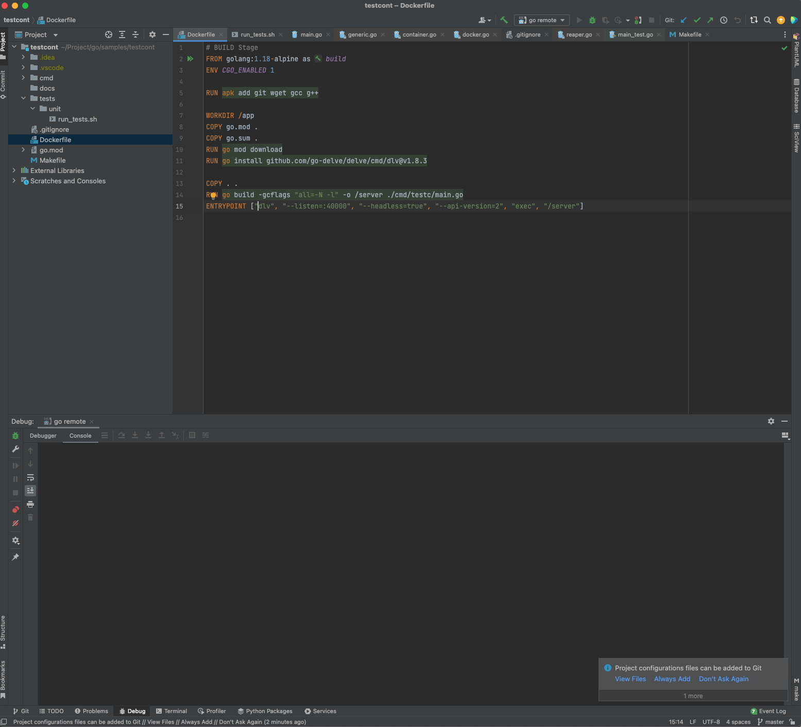
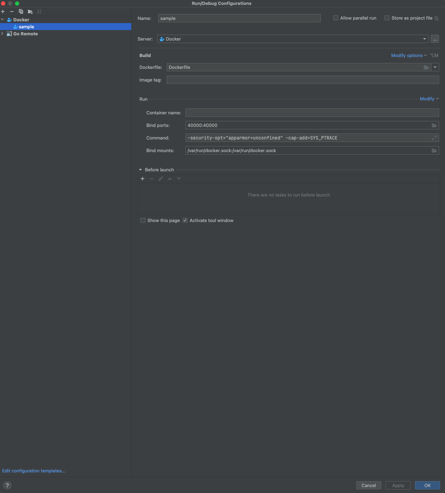
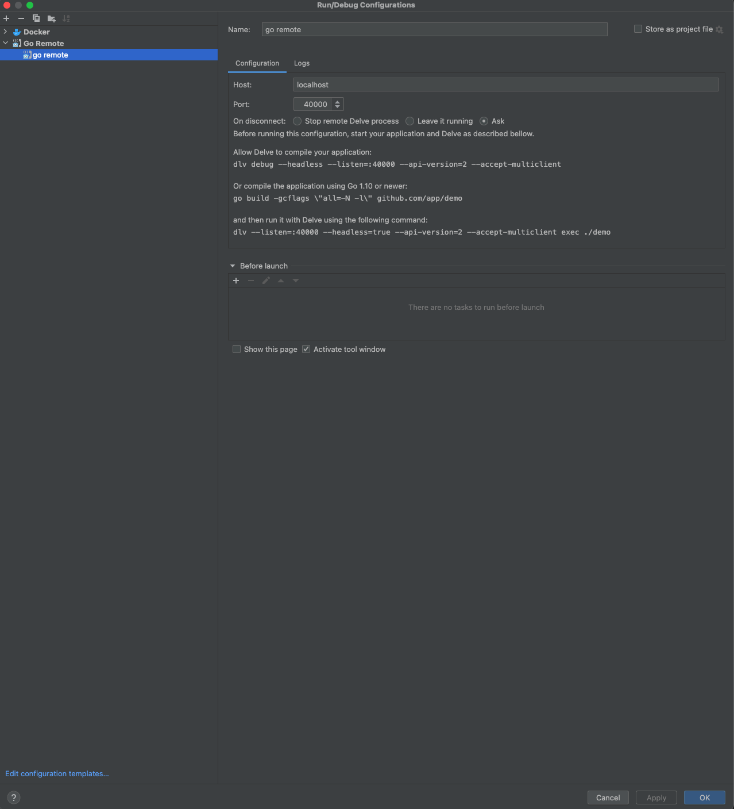

# Test container debugging using delv and IntelliJ

## Base documentation
 Documentation is based on this [article on golang](https://blog.jetbrains.com/go/2018/04/30/debugging-containerized-go-applications/)
 
### Setup Dockerfile

Create a dockerfile as is

### Setup Dockerfile 

At intellij go to "Edit Runconfiguration" > "Add New configuration" > "Docker" > Dockerfile

### Setup Go Remote 

"Edit Runconfiguration" > "Add New configuration" > "Goremote"

### Running application
- Run `sample` app which will create docker containers ready
- Create break point in main application. And run go-remote, it breaks at needed breakpoints